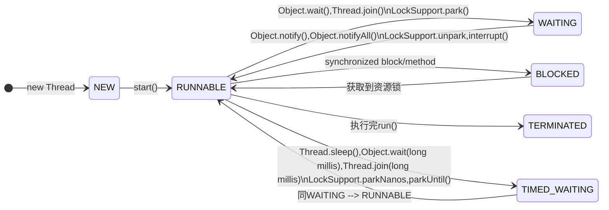

### **线程状态介绍**

Java中的线程状态主要有以下几个：
- NEW
- RUNNABLE
- BLOCKED
- TIMED_WAITING
- WAITING
- TERMINATED


### **状态转移图**

按照jdk-docs上不同状态的说明，可以总结为下面的状态转移图：



### **用代码验证状态转移**

验证方法
- 1.在主线程中启动子线程，子线程用全局锁lck来与主线程交互
- 2.使用BufferedReader使线程挂起，用于观察线程状态
- 3.使用JDK自带的jconsole来查看线程当前的状态

验证代码

```java
import java.io.BufferedReader;
import java.io.InputStreamReader;

public class ThreadDemo1 {
    
    public static Object lck = new Object();

    public static void main(String[] args) throws Exception {
        Thread t1 = new Thread(new Runnable(){
            @Override
            public void run() {
                synchronized(lck) {
                    System.out.println("t1 thread got lck");
                    try { new BufferedReader(new InputStreamReader(System.in)).readLine();} catch (Exception e) {}
                    // tip1
                }

                System.out.println("t1 thread ready to notifyAll");
                try { new BufferedReader(new InputStreamReader(System.in)).readLine();} catch (Exception e) {}
                // tip3
 
                synchronized(lck) {
                    lck.notifyAll();
                    // tip4
                }
                
                System.out.println("t1 thread release lck");
            }
        });
        t1.setName("t1");
        t1.start();

        Thread.sleep(2000L);
        // tip2

        System.out.println("main thread try to get lck");
        synchronized(lck) {
            System.out.println("main thread ready to wait lck");
            lck.wait();
            System.out.println("main thread got lck");
            try { new BufferedReader(new InputStreamReader(System.in)).readLine();} catch (Exception e) {}
        }

        System.out.println("end");
    }
}
```

各个关键状态说明

- tip1

    此时线程t1在`等待io输入，在JVM的状态为RUNNABLE`，主线程由于要经过sleep，通常情况下会晚于t1到达synchronized(lck)，所以此时主线程为BLOCKED

    > **等待io为什么状态仍然是RUNNABLE而不是BLOCKED?**
    >
    > RUNNABLE和BLOCKED是JVM中定义的线程状态。
    > RUNNABLE表示线程当前可以被JVM调度，BLOCKED表示在等待获取锁。
    > 而当在线程调用了阻塞io的api时，操作系统的调度会将线程变为休眠状态，而JVM层面并不会关心操作系统调度相关的线程状态，所以仍然未RUNNABLE。

    t1状态
    

    主线程状态
    

- tip2

    主线程调用sleep变为状态TIMED_WAITING

    主线程状态
    

- tip3

    t1已经释放了锁lck，由于等待io输入，在JVM的状态仍然是RUNNABLE；此时主线程应该获得了lck，从而进入了同步块，变成状态RUNNABLE，但很快遇到了lck.wait()，进入状态WAITING

    t1状态
    

    主线程状态
    

- tip4

    t1再次获得锁lck，然后执行lck.notifyAll，这会唤醒所有等待lck的线程，然后t1结束；因为这里只有一个主线程，主线程由WAITING变为RUNNABLE

    > **主线程在有些情况下可能仍然会转为BLOCK状态**
    > 
    > 如果此时有多个在等待锁lck的线程，而这个主线程没有抢到锁lck，则状态又会变为BLOCK

    主线程状态
    
