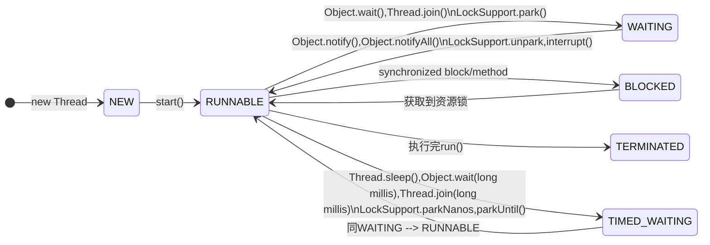

### 线程状态介绍

Java中的线程状态主要有以下几个：
- NEW
- RUNNABLE
- BLOCKED
- TIMED_WAITING
- WAITING
- TERMINATED


### 状态转移图

按照jdk-docs上不同状态的说明，可以总结为下面的状态转移图：



### 状态转移demo

demo方案
- 1.在主线程中启动子线程，子线程用全局锁lck来与主线程交互
- 2.使用BufferedReader使线程挂起，用于观察线程状态
- 3.使用JDK自带的jconsole来查看线程当前的状态

验证代码

```java
import java.io.BufferedReader;
import java.io.InputStreamReader;

public class ThreadDemo1 {
    
    public static Object lck = new Object();

    public static void main(String[] args) throws Exception {
        Thread t1 = new Thread(new Runnable(){
            @Override
            public void run() {
                synchronized(lck) {
                    System.out.println("t1 thread got lck");
                    try { new BufferedReader(new InputStreamReader(System.in)).readLine();} catch (Exception e) {}
                }

                System.out.println("t1 thread ready to notifyAll");
                try { new BufferedReader(new InputStreamReader(System.in)).readLine();} catch (Exception e) {}
 
                synchronized(lck) {
                    lck.notifyAll();
                }
                
                System.out.println("t1 thread release lck");
            }
        });
        t1.start();

        Thread.sleep(2000L);

        System.out.println("main thread try to get lck");
        synchronized(lck) {
            System.out.println("main thread ready to wait lck");
            lck.wait();
            System.out.println("main thread got lck");
            try { new BufferedReader(new InputStreamReader(System.in)).readLine();} catch (Exception e) {}
        }

        System.out.println("end");
    }
}
```