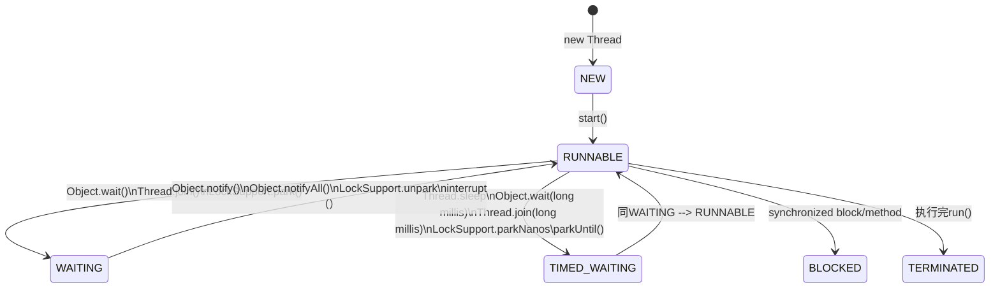

Java中的线程状态主要有以下几个：

| 状态           | 说明           |
| ------------- | ------------- |
| NEW           |               | 
| RUNNABLE      |               |
| BLOCKED       |               |
| TIMED_WAITING |               |
| WAITING       |               |
| TERMINATED    |               |

